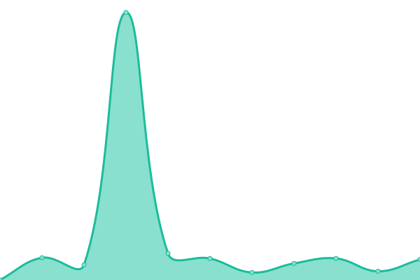

# [📈 Live Status](https://thwiki.github.io/status): <!--live status--> **🟩 All systems operational**

This repository contains the open-source uptime monitor and status page for [THBWiki](https://thwiki.cc/), powered by [Upptime](https://github.com/upptime/upptime).

With [Upptime](https://upptime.js.org), you can get your own unlimited and free uptime monitor and status page, powered entirely by a GitHub repository. We use [Issues](https://github.com/thwiki/status/issues) as incident reports, [Actions](https://github.com/thwiki/status/actions) as uptime monitors, and [Pages](https://thwiki.github.io/status) for the status page.

<!--start: status pages-->
<!-- This summary is generated by Upptime (https://github.com/upptime/upptime) -->
<!-- Do not edit this manually, your changes will be overwritten -->
<!-- prettier-ignore -->
| URL | Status | History | Response Time | Uptime |
| --- | ------ | ------- | ------------- | ------ |
|  [THBWiki](https://thwiki.cc/%E9%A6%96%E9%A1%B5) | 🟩 Up | [thb-wiki.yml](https://github.com/thwiki/status/commits/HEAD/history/thb-wiki.yml) | 

 1133ms
     
 | 

<a href="https://thwiki.github.io/status/history/thb-wiki">100.00%</a>
    

|  [THBWiki CD Site](https://cd.thwiki.cc/) | 🟩 Up | [thb-wiki-cd-site.yml](https://github.com/thwiki/status/commits/HEAD/history/thb-wiki-cd-site.yml) | 

 783ms
     
 | 

<a href="https://thwiki.github.io/status/history/thb-wiki-cd-site">100.00%</a>
    

|  [THBWiki Tools](https://tool.thwiki.cc/) | 🟩 Up | [thb-wiki-tools.yml](https://github.com/thwiki/status/commits/HEAD/history/thb-wiki-tools.yml) | 

 271ms
     
 | 

<a href="https://thwiki.github.io/status/history/thb-wiki-tools">100.00%</a>
    

|  [Touhou Group](https://touhou.group/) | 🟩 Up | [touhou-group.yml](https://github.com/thwiki/status/commits/HEAD/history/touhou-group.yml) | 

 786ms
     
 | 

<a href="https://thwiki.github.io/status/history/touhou-group">100.00%</a>
    

|  [MineCraft Gensoukyo](https://gensoukyo.moe/) | 🟩 Up | [mine-craft-gensoukyo.yml](https://github.com/thwiki/status/commits/HEAD/history/mine-craft-gensoukyo.yml) | 

 2272ms
     
 | 

<a href="https://thwiki.github.io/status/history/mine-craft-gensoukyo">100.00%</a>
    

|  [Gensoukyo Map](https://map.thwiki.cc/) | 🟩 Up | [gensoukyo-map.yml](https://github.com/thwiki/status/commits/HEAD/history/gensoukyo-map.yml) | 

 288ms
     
 | 

<a href="https://thwiki.github.io/status/history/gensoukyo-map">100.00%</a>
    

|  [Dream](https://dream.thwiki.cc/) | 🟩 Up | [dream.yml](https://github.com/thwiki/status/commits/HEAD/history/dream.yml) | 

 245ms
     
 | 

<a href="https://thwiki.github.io/status/history/dream">100.00%</a>
    

|  [THBWiki Calendar Api](https://calendar.thbwiki.cc/) | 🟩 Up | [thb-wiki-calendar-api.yml](https://github.com/thwiki/status/commits/HEAD/history/thb-wiki-calendar-api.yml) | 

 724ms
     
 | 

<a href="https://thwiki.github.io/status/history/thb-wiki-calendar-api">100.00%</a>
    

|  [Lyrics](https://lyrics.thwiki.cc/) | 🟩 Up | [lyrics.yml](https://github.com/thwiki/status/commits/HEAD/history/lyrics.yml) | 

 263ms
     
 | 

<a href="https://thwiki.github.io/status/history/lyrics">100.00%</a>
    

|  [Omake](https://omake.thwiki.cc/) | 🟩 Up | [omake.yml](https://github.com/thwiki/status/commits/HEAD/history/omake.yml) | 

 230ms
     
 | 

<a href="https://thwiki.github.io/status/history/omake">100.00%</a>
    

|  [Patch](https://patch.thwiki.cc/) | 🟩 Up | [patch.yml](https://github.com/thwiki/status/commits/HEAD/history/patch.yml) | 

 604ms
     
 | 

<a href="https://thwiki.github.io/status/history/patch">100.00%</a>
    

|  [Avatar](https://avatar.thbwiki.cc/thwikicc_wiki_default_l.jpg) | 🟩 Up | [avatar.yml](https://github.com/thwiki/status/commits/HEAD/history/avatar.yml) | 

 106ms
     
 | 

<a href="https://thwiki.github.io/status/history/avatar">100.00%</a>
    

|  [Touhou98 Font](https://touhou98.touhou.moe/) | 🟩 Up | [touhou98-font.yml](https://github.com/thwiki/status/commits/HEAD/history/touhou98-font.yml) | 

 613ms
     
 | 

<a href="https://thwiki.github.io/status/history/touhou98-font">100.00%</a>
    

|  [TohoMoe](https://toho.moe/) | 🟩 Up | [toho-moe.yml](https://github.com/thwiki/status/commits/HEAD/history/toho-moe.yml) | 

 377ms
     
 | 

<a href="https://thwiki.github.io/status/history/toho-moe">100.00%</a>
    

|  [Static Wiki](https://thbwiki.cc/%E9%A6%96%E9%A1%B5) | 🟩 Up | [static-wiki.yml](https://github.com/thwiki/status/commits/HEAD/history/static-wiki.yml) | 

 397ms
     
 | 

<a href="https://thwiki.github.io/status/history/static-wiki">100.00%</a>
    

<!--end: status pages-->

[**Visit our status website →**](https://thwiki.github.io/status)

## 📄 License

- Powered by: [Upptime](https://github.com/upptime/upptime)
- Code: [MIT](./LICENSE) © [THBWiki](https://thwiki.cc/)
- Data in the `./history` directory: [Open Database License](https://opendatacommons.org/licenses/odbl/1-0/)
